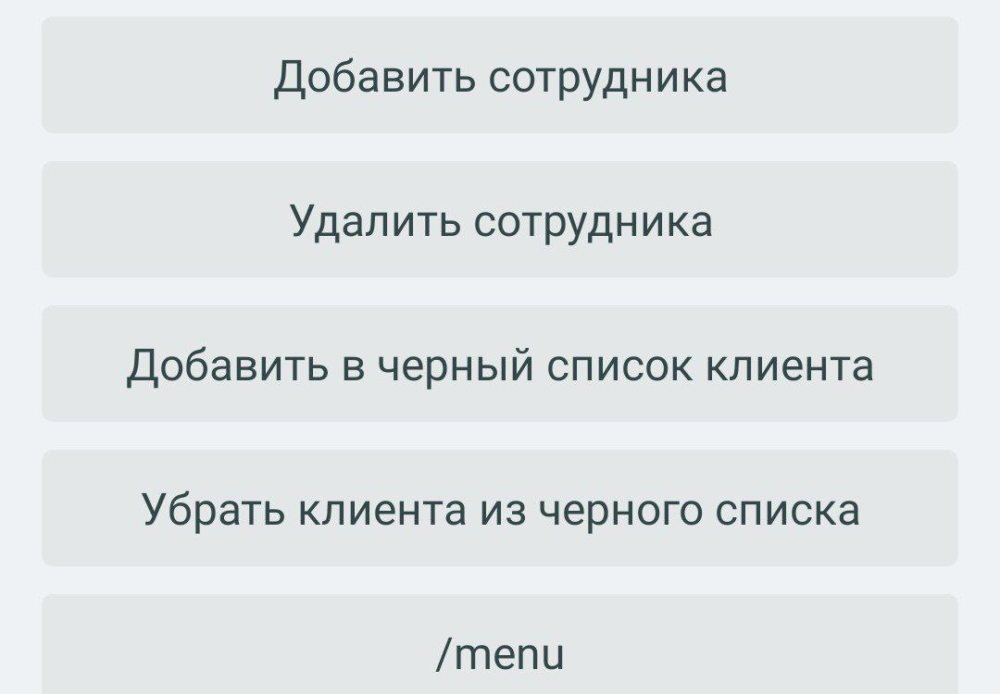

<!DOCTYPE html>
<html>
<head>
    <meta charset="UTF-8">
    <title>Telegram-Бот для записи на услуги</title>
    
</head>
<body>
    <h1>Telegram-Бот для записи на услуги</h1>

<h2>Оглавление</h2>
    <ul>
        <li><a href="#Описание-проекта">Описание проекта</a></li>
        <li><a href="#Цели-проекта">Цели проекта</a></li>
        <li><a href="#Функциональность">Функциональность</a></li>
        <li><a href="#Команды">Команды</a></li>
        <li><a href="#Система-Черного-Списка">Система Черного Списка</a></li>
        <li><a href="#Пользовательское-Соглашение">Пользовательское Соглашение</a></li>
        <li><a href="#Оценка-Услуги">Оценка Услуги</a></li>
        <li><a href="#Технологии">Технологии</a></li>
        <li><a href="#Контактная-информация">Контактная информация</a></li>
    </ul>

<h2 id="Описание-проекта">Описание проекта</h2>
    
Проект "Telegram-Бот для Записи на Услуги" разработан с целью упростить процесс записи клиентов на различные услуги и управления расписанием. Этот бот предоставляет удобный способ для клиентов записаться на услугу через Telegram, а также для сотрудников и администраторов управлять записями и расписанием. Для более удобного управления данными бота, доступен веб-интерфейс, построенный на базе fastAPI.

<h2 id='Цели-проекта'>Цели проекта</h2>
    
1.Упростить процесс записи: Бот облегчит процесс записи клиентов на услуги, сократив необходимость вручную согласовывать дату и время с клиентами.

    
2.Увеличить доступность: Запись на услуги будет доступна 24/7 через Telegram, что позволит клиентам делать запись в удобное для них время.

    
3.Улучшить управление записями: Администраторы и сотрудники смогут легко просматривать и управлять расписанием и записями через интерфейс бота.

    
4.Множество сфер применения: Бот может быть успешно использован в разных сферах, от маникюра до тату салонов, благодаря возможности добавления и изменения разных видов услуг и подуслуг.

    
5.Разделение мастеров: В боте предусмотрено разделение между мастерами, у каждого из них свой индивидуальный календарь, и клиенты могут сами выбирать, к какому мастеру записаться.

    
6.Добавление новых функций: Планирую расширить функциональность бота, интеграцию с платежными системами и многое другое.

    <h2 id="Функциональность">Функциональность</h2>
    <ul>
        <li>
            <h3>Календарь с доступными датами</h3>
            
Клиенты могут просматривать календарь с доступными датами для записи на услуги в виде красочных инлайн-кнопок, что делает процесс выбора даты максимально удобным и интуитивно понятным.

            

                
            

        </li>
        <li>
            <h3>Выбор даты и времени</h3>
            
Клиенты могут выбирать удобные даты, после чего им предоставляется список свободных временных интервалов для записи на услугу.

            

                
            

        </li>
        <li>
            <h3>Запись на услугу</h3>
            
После выбора даты и времени, бот автоматически записывает клиента на выбранную услугу и уведомляет мастера, отправляя ему SMS-сообщение с информацией о новой записи.

            

                
            

        </li>
        <li>
            <h3>Роли и доступ</h3>
            
Бот поддерживает роли клиента, сотрудника и администратора с разными правами доступа.

            

                
                
            

        </li>
        <li>
            <h3>Автоматические напоминания и оценки услуг</h3>
            
Бот автоматически напоминает клиентам о возможности оценить оказанную услугу после начала процедуры.

        </li>
    </ul>

<h2 id="Команды">Команды</h2>
    <ul>
        <li><code>/start</code>: Начальная команда, которая запрашивает у пользователя согласие на обработку персональных данных, а затем предоставляет доступ к основным функциям бота.</li>
        <li><code>/menu</code>: Меню, где пользователь может выбрать различные функции, такие как изменение имени, фамилии, номера телефона и доступ к услугам.</li>
        <li><code>/employee</code>: Для сотрудников, чтобы просматривать и добавлять записи.</li>
        <li><code>/admin</code>: Для администраторов, чтобы управлять сотрудниками и услугами.</li>
    </ul>

</body>
</html>
